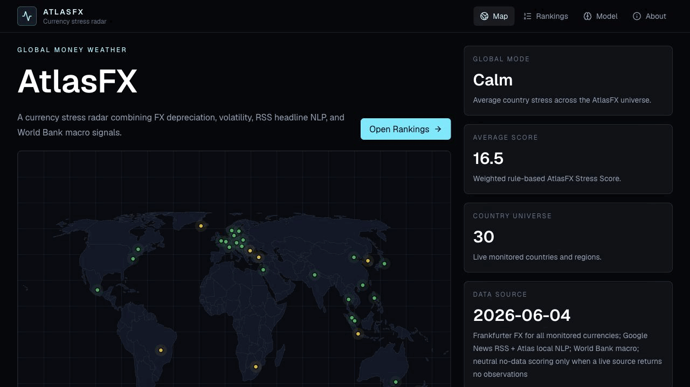
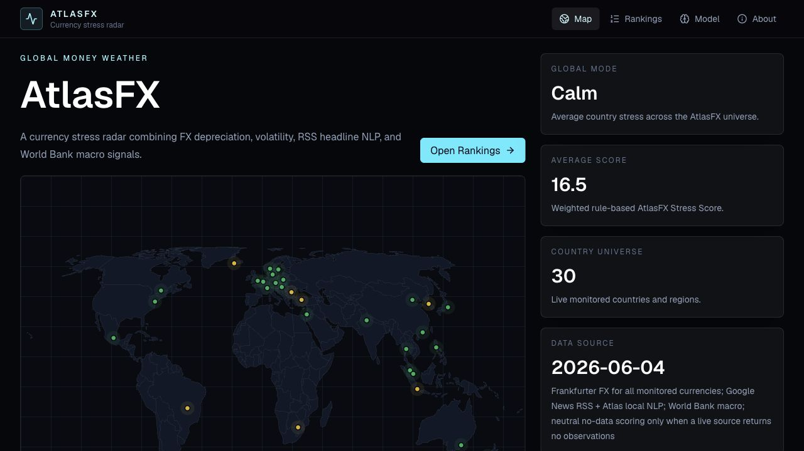
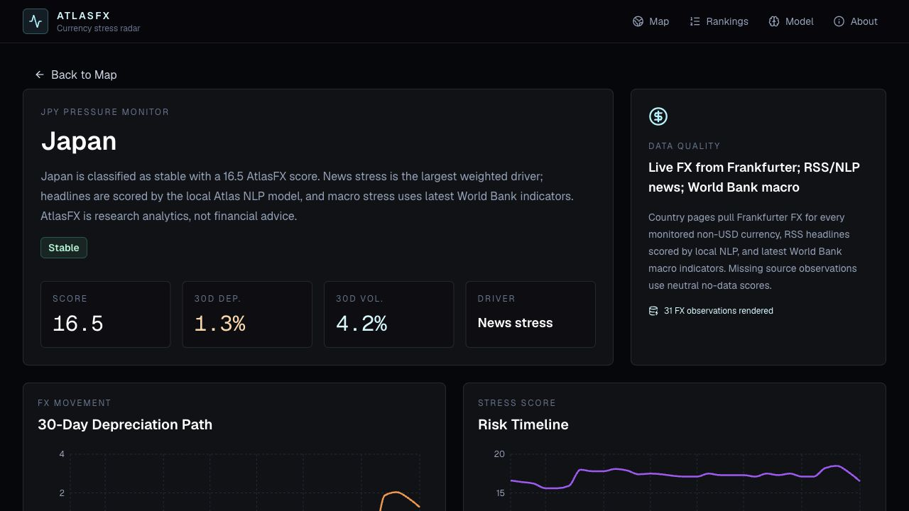
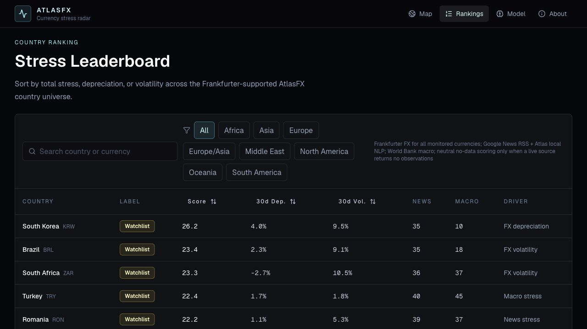
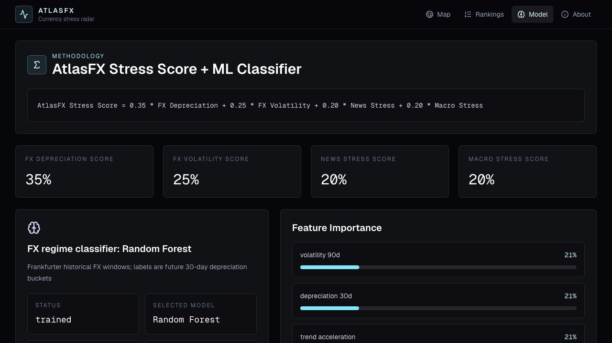
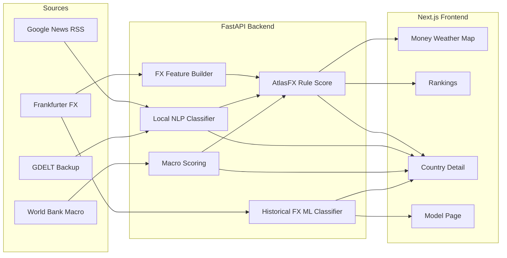

# AtlasFX

**A global money weather map for currency stress detection.**

AtlasFX is a portfolio-grade financial ML dashboard that turns exchange-rate
movement, headline sentiment, and macro indicators into an explainable
country-level currency stress signal.

**Live preview:** [atlasfx-84zwjxszk-dhruv-kekin-topranis-projects.vercel.app](https://atlasfx-84zwjxszk-dhruv-kekin-topranis-projects.vercel.app)

## Demo



It does **not** forecast exact FX prices and it does **not** provide financial
advice. The product goal is early stress detection: show where pressure is
building, why the model thinks it matters, and which signals are driving the
score.

## Product Snapshot

| Area | Status |
| --- | --- |
| Country universe | 30 countries/regions, matching the current Frankfurter `/currencies` coverage |
| FX data | Frankfurter historical rates for every monitored non-USD currency |
| News data | Google News RSS primary, GDELT backup |
| NLP | Local TF-IDF + logistic regression headline stress model |
| Macro data | World Bank indicators |
| ML classifier | Logistic regression and random forest FX regime classifiers trained on historical Frankfurter windows |
| Frontend | Next.js, React, TypeScript, Tailwind, Recharts, React Simple Maps |
| Backend | FastAPI, Pydantic, Pandas/NumPy, scikit-learn |

## Screenshots









## What Works

- Global currency stress map with live country risk markers
- Sortable rankings table across the AtlasFX country universe
- Country detail pages with FX movement, volatility, risk breakdown, top drivers, and source quality
- RSS headline ingestion scored by a local non-LLM NLP model
- World Bank macro scoring for inflation, GDP growth, unemployment, and current-account pressure
- Baseline ML classifier with logistic regression vs random forest comparison
- Local NLP holdout evaluation for headline stress scoring
- Server-seeded pages so the app renders real API data first when the backend is running
- Neutral no-data fallbacks only when a live source returns no observations

## Portfolio Positioning

AtlasFX is intentionally scoped as a serious financial ML product demo:

- **Real source discipline:** every monitored currency exists in the current Frankfurter API.
- **Explainability first:** every country score exposes weighted drivers and source quality.
- **Non-LLM NLP:** headline stress is scored by a local auditable model, not an opaque prompt.
- **Model honesty:** classifier metrics, class imbalance, and limitations are visible in the UI.
- **No trading claims:** the product frames signals as research analytics, not investment advice.

## Architecture



## Scoring Methodology

```text
AtlasFX Stress Score =
0.35 * FX Depreciation Score
+ 0.25 * FX Volatility Score
+ 0.20 * News Stress Score
+ 0.20 * Macro Stress Score
```

The current ML classifier is separate from the rule score. It trains baseline
logistic regression and random forest models on historical Frankfurter FX
windows and labels each window by future 30-day depreciation:

| Future 30-day depreciation | Label |
| ---: | --- |
| `< 3%` | Stable |
| `3% to 7%` | Watchlist |
| `7% to 15%` | Stress |
| `> 15%` | Crisis Risk |

## Data Sources

- [Frankfurter](https://api.frankfurter.dev/v1) for exchange rates
- Google News RSS for free/keyless country headline feeds
- [GDELT DOC API](https://api.gdeltproject.org/api/v2/doc/doc) as a backup headline provider
- [World Bank API](https://api.worldbank.org/v2) for macro indicators

## API Surface

```text
GET /health
GET /api/fx/latest
GET /api/fx/history
GET /api/risk/global
GET /api/risk/country/{country_code}
GET /api/rankings
GET /api/news/global
GET /api/news/country/{country_code}
GET /api/macro/global
GET /api/macro/country/{country_code}
GET /api/model/feature-importance
GET /api/model/predict/{country_code}
```

## Local Setup

### Backend

```bash
cd apps/api
python -m venv .venv
source .venv/bin/activate
pip install -r requirements.txt
uvicorn app.main:app --reload
```

Open `http://127.0.0.1:8000/docs`.

### Frontend

```bash
cd apps/web
npm install
npm run dev
```

Open `http://127.0.0.1:3000`.

The web app reads `NEXT_PUBLIC_ATLASFX_API_URL`; if unset, it uses
`http://127.0.0.1:8000`.

## Snapshot Scripts

```bash
cd apps/api
.venv/bin/python scripts/fetch_news_signals.py
.venv/bin/python scripts/fetch_macro_data.py
.venv/bin/python scripts/train_model.py
```

These scripts write generated reports under `data/processed/`, which is ignored
by git to avoid committing bulky derived data.

## Validation

```bash
cd apps/api
.venv/bin/pytest
.venv/bin/ruff check .
```

```bash
cd apps/web
npm run lint
npm run build
```

Current validation status:

- Backend tests: 19 passing
- Backend lint: passing
- Frontend lint: passing
- Frontend production build: passing
- GitHub Actions CI: configured for backend and frontend checks

## Known Limitations

- The baseline ML classifiers are FX-regime-only; news and macro are not yet part of historical ML features.
- Crisis labels are rare in the Frankfurter training windows, so classifier metrics must be interpreted as baseline diagnostics.
- Google News RSS is free/keyless and useful for demos, but it is less formally productized than a paid licensed news feed.
- No financial advice, investment advice, or trading recommendations.

## Roadmap

1. Persist raw source responses with reproducible dataset versioning.
2. Add chronological backtests for the FX regime classifier.
3. Add historical feature tables for news and macro.
4. Add permutation importance or SHAP explanations.
5. Add similar historical windows for country-level explanations.

## Disclaimer

AtlasFX is a research and analytics project. It is not financial advice,
investment advice, or a trading recommendation system. Currency markets are
volatile and affected by many unpredictable factors.
