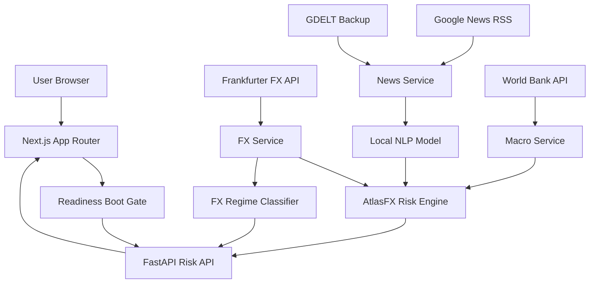

# AtlasFX Architecture

AtlasFX is a monorepo with a Next.js frontend and FastAPI backend.
The public country universe is constrained to currencies currently returned by
Frankfurter so visible FX metrics share one exchange-rate source.

## System Diagram

## Frontend

- `apps/web/src/components/data-boot-gate.tsx`: verifies connector readiness,
  preloads the global risk payload, and preloads route-specific country/model
  payloads before showing product pages.
- `apps/web/src/components/app-loading-screen.tsx`: full-screen connectivity
  status view used during boot and route transitions.
- `apps/web/src/app/page.tsx`: server-seeded global dashboard.
- `apps/web/src/app/rankings/page.tsx`: server-seeded rankings table.
- `apps/web/src/app/country/[code]/page.tsx`: server-seeded country detail page.
- `apps/web/src/app/model/page.tsx`: model methodology and live classifier diagnostics.

Replay routes were removed to keep the portfolio focused on real signals rather
than placeholder timelines.

## Backend

- `app/services/fx.py`: Frankfurter API client.
- `app/services/live_fx_risk.py`: combines FX, news, macro, and ML signals.
- `app/services/news.py`: Google News RSS primary provider, GDELT backup, local NLP scoring.
- `app/services/macro.py`: World Bank macro scoring.
- `app/services/readiness.py`: connector health checks for the frontend boot gate.
- `app/ml/news_sentiment.py`: local headline stress model.
- `app/ml/risk_classifier.py`: historical FX regime classifier.

## Source Gap Policy

AtlasFX does not invent live data. If a source lacks coverage, the API returns a
neutral no-data component score and marks the gap in `data_quality`.
